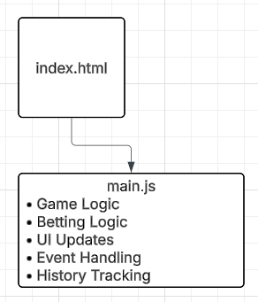
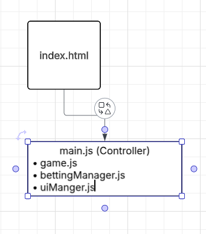

# 🃏 Blackjack Refactor Project

## 📌 Overview
This project refactors a Blackjack web application into a modular architecture using ES6 modules. The goal is to improve **maintainability, readability, and scalability** without changing functionality.

---

## 🔹 Task 1a: Current Architecture

### 🏗️ Structure
The original project used a **single JavaScript file (`main.js`)** that handled all functionality.

### Responsibilities in `main.js`
- Game logic  
- Betting system  
- UI rendering  
- Event handling  
- Data management  

### ⚠️ Issues
- Violates the **Single Responsibility Principle**
- Difficult to debug and maintain  
- Hard for new developers to understand  
- High risk of breaking unrelated features  

### 📊 Current Architecture Diagram


---

## 🔹 Task 1b: Proposed Modular Design

### 🧩 New Structure
The application is refactored into separate modules with clear responsibilities.

---

### 📦 `game.js`
**Responsibility:** Handles all game mechanics and rules  

**Includes:**
- Card logic  
- Player/dealer actions  
- Score calculations  

---

### 📦 `bettingManager.js`
**Responsibility:** Manages all betting and financial logic  

**Includes:**
- Player balance  
- Bet placement  
- Win/loss tracking  
- Game history  

---

### 📦 `uiManager.js`
**Responsibility:** Handles all UI updates and DOM manipulation  

**Includes:**
- Updating displays  
- Rendering history  
- Showing scores and results  

---

### ✅ Refactor Improvements
- Clear naming conventions  
- Single Responsibility Principle applied  
- Reduced duplicated code (DRY)  
- Improved error handling (invalid bets, etc.)  

---

### 📊 New Architecture Diagram


---

## 🔹 Task 2: Refactor Implementation

### ✅ Refactor 1: Betting System Extraction

**Module:** `bettingManager.js`

**Changes:**
- Moved all betting logic out of `main.js`  
- Added functions:
  - `placeBet()`  
  - `finalizeBet()`  
  - Getter functions for state  

**Result:**
- Cleaner main file  
- Centralized financial logic  
- Easier to maintain and extend  

---

### ✅ Refactor 2: UI Logic Extraction

**Module:** `uiManager.js`

**Changes:**
- Moved all DOM updates into one module  
- Created reusable display functions  

**Result:**
- UI is fully separated from logic  
- Easier to redesign interface  
- Improved code readability  

---

## 🔧 Example ES6 Module Usage

```javascript
import { placeBet } from "./bettingManager.js";
import { updateBettingDisplay } from "./uiManager.js";
